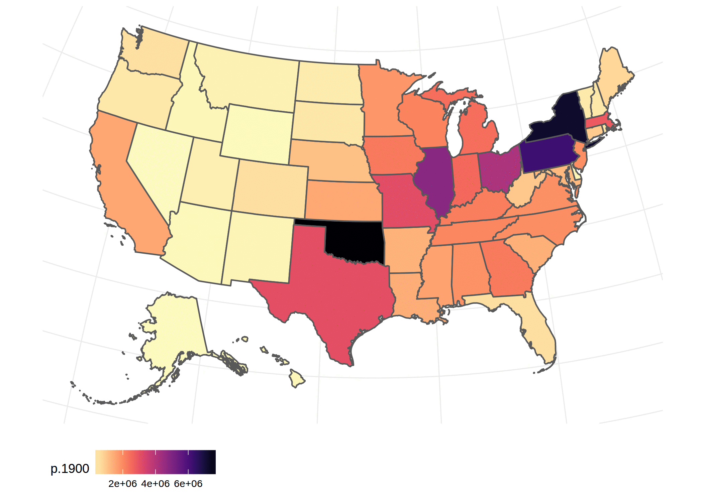

```{r setup, include=FALSE}
options(htmltools.dir.version = FALSE)
knitr::opts_chunk$set(cache = TRUE)
knitr::opts_chunk$set(dev = 'svg')
options(device = function(file, width, height) {
  svg(tempfile(), width = width, height = height)
})
library(magrittr)
```

This document introduces various techniques for making staic maps from spatial data.

# Base R Graphics

## Pure Base R 

### Vector Data in `sp` Format

#### Example 1

A map with Spatial Points and Spatial Polygons, where the size of the point is scaled to the 'zinc' level in the soil at that point.

```{r 01, fig.width=5, fig.height=4, fig.align='center'}
suppressPackageStartupMessages(library(sp))
demo(meuse, ask = FALSE, echo = FALSE) 
crs.longlat = CRS("+init=epsg:4326")
meuse.longlat = spTransform(meuse, crs.longlat)
meuse.riv.longlat <- spTransform(meuse.riv, crs.longlat)
grid.lines <- gridlines(meuse.longlat)

par(mar = c(1, 1, 1, 1))
plot(methods::as(meuse.longlat, "Spatial"), expandBB=c(0.05,0,0.1,0))
plot(grid.lines, add = TRUE, col = grey(.8))
plot(meuse.longlat, pch=1, cex = sqrt(meuse$zinc)/12, add = TRUE)
text(labels(grid.lines, side=2:3), col = grey(.7), offset=1.5)
v = c(100,200,400,800,1600)
legend("bottomright", legend = v, pch = 1, pt.cex = sqrt(v)/12,
       text.col =grey(.8), box.col=grey(0.8), title='Zinc Conc. (ppm)')
plot(meuse.riv.longlat, add = TRUE, col = grey(.9, alpha = .5))
```

#### Example 2

World map in Winkel-triple projection showing all cities with population > 1Million. The size of the circle representing the city is proportional to its population.


```{r 02, fig.width=8, fig.height=6, fig.align='center'}
library(maps)
data(world.cities)
world.cities <- world.cities[world.cities$pop>1000000,]
coordinates(world.cities) <- ~long+lat 
proj4string(world.cities) <- '+init=epsg:4326'

world <- rnaturalearth::countries110
world <- world[world$name != 'Antarctica',]

grid.lines.mj <- gridlines(world,easts = seq(-180,180,by=30), norths = seq(-90,90,by=30))
grid.lines.mi <- gridlines(world,easts = seq(-165,195,by=15), norths = seq(-90,90,by=15))
world.cities <- spTransform(world.cities, CRS("+proj=wintri"))
world <- spTransform(world, CRS("+proj=wintri"))
grid.lines.mj <- spTransform(grid.lines.mj,CRS("+proj=wintri"))
grid.lines.mi <- spTransform(grid.lines.mi,CRS("+proj=wintri"))

par(mar = c(8, 0.1, 0.1, 0.1))
plot(methods::as(world, 'Spatial'), expandBB=c(0,0,0.05,0.05))

plot(grid.lines.mi, col=grey(0.95), add=T)
plot(grid.lines.mj, col=grey(0.9), add=T)
text(labels(grid.lines.mj, side=1:2, labelCRS = CRS("+init=epsg:4326")), col = grey(.6), offset=0.3)

plot(world, add=TRUE, border=grey(0.2), col=grey(0.9))
plot(world.cities, add=TRUE, col='#FF5A0088', pch=20,
     cex=world.cities$pop/2000000)

v = c(1,4,8,12)
legend("topright", legend = v, pch = 20, pt.cex = v/2,
       text.col =grey(.7), box.col=grey(0.9),
       col = '#FF5A0088',
       title='Pop. (Millions)', horiz =T)
```

### Raster Data

Mesus data set.

```{r 03, fig.width=5, fig.height=5, fig.align='center'}
suppressPackageStartupMessages(library(raster))
r <- raster(system.file("external/test.grd", package="raster"))
plot(r)
plot(meuse, add=T) # Add Vector Data
box(); title('Raster + Vector')
```

## Using `cartography` Package

Plot of Internet usage as percentage of the population of Afrincan Countries.

```{r 04, fig.width=5, fig.height=5, fig.align='center'}
suppressPackageStartupMessages(library(cartography))

world <- sf::st_as_sf(rnaturalearth::countries110)
internet_usage <- suppressMessages(readr::read_csv(
  system.file(
    'extdata', 'africa-internet_usage-2015.csv',
    package = 'user2017.geodataviz')))

africa <- dplyr::filter(world, region_un=='Africa') %>%
  dplyr::left_join(internet_usage %>% dplyr::select(
    `Country Code`, `2015 [YR2015]`
  ) %>% dplyr::rename(iso_a3=`Country Code`, internet.usage.2015=`2015 [YR2015]`),
  by = 'iso_a3') %>%
  st_transform(crs="+proj=laea +lon_0=18.984375")

par(mar = c(0.5, 0.5, 0.5, 0.5))
plot(st_geometry(africa), border=grey(0.2), col=grey(0.9))
plot(st_centroid(africa), add=TRUE, col='black', pch=20)
{{propSymbolsLayer(x=africa, var='internet.usage.2015', inches = 0.3, col = '#FF5A0088')}}
```

# Plotting using `ggplot2`

## Just `ggplot2`

### Vector Data in `sp` Format

Choropleth from estimated median GDP of European countries.

```{r 05, fig.width=6, fig.height=5, fig.align='center'}
world <- rnaturalearth::countries110
europe <- world[world$region_un=="Europe"&world$name!='Russia',]
# plot(europe)

# Let's add a unique ID column to our data.
{{europe@data$id <- row.names(europe@data)}}

# A bounding box for continental Europe.
europe.bbox <- SpatialPolygons(list(Polygons(list(Polygon(
  matrix(c(-25,29,45,29,45,75,-25,75,-25,29),byrow = T,ncol = 2)
)), ID = 1)), proj4string = CRS(proj4string(europe)))

# Get polygons that are only in continental Europe.
europe.clipped <-
{{  rgeos::gIntersection(europe, europe.bbox, byid = TRUE, id=europe$id)}}

# tidy up the data for ggplot2
europe.tidy <- broom::tidy(europe.clipped)
europe.tidy <- dplyr::left_join(europe.tidy, europe@data, by='id')
library(ggplot2)
ggplot(europe.tidy, aes(long,lat, group=group,fill=gdp_md_est/1000)) +
  geom_polygon(alpha=0.8,color='black') +
  coord_map("azequalarea") +
  hrbrthemes::theme_ipsum_rc() +
  viridis::scale_fill_viridis(
    name='Median GDP \n(in Billions)', direction = -1, labels=scales::dollar) +
  labs(x=NULL, y=NULL, 
       title='Median GDP Estimates of\nContinental Europe & Iceland',
       caption='Source: http://www.naturalearthdata.com/')

```

### Vector Data in `sf` Format

Choropleth from estimated median GDP of European countries.

```{r 06, fig.width=6, fig.height=5, fig.align='center'}
suppressPackageStartupMessages(library(sf))

world <- st_as_sf(rnaturalearth::countries110)
europe <- dplyr::filter(world, region_un=="Europe" & name!='Russia')

# A bounding box for continental Europe.
europe.bbox <- st_polygon(list(
  matrix(c(-25,29,45,29,45,75,-25,75,-25,29),byrow = T,ncol = 2)))

europe.clipped <- suppressWarnings(st_intersection(europe, st_sfc(europe.bbox, crs=st_crs(europe))))


ggplot(europe.clipped, aes(fill=gdp_md_est/1000)) +
  geom_sf(alpha=0.8,col='white') +
  coord_sf(crs="+proj=aea +lat_1=36.333333333333336 +lat_2=65.66666666666667 +lon_0=14") +
  hrbrthemes::theme_ipsum_rc() +
  viridis::scale_fill_viridis(
    name='Median GDP \n(in Billions)', direction = -1, labels=scales::dollar) +
  labs(x=NULL, y=NULL, title=NULL,
       caption='Source: http://www.naturalearthdata.com/')
```

### Raster Data

```{r 07, fig.width=6, fig.height=5, fig.align='center'}

suppressPackageStartupMessages(library(raster))

r <- raster(system.file("external/test.grd", package="raster"))

{{rasterVis::gplot(r) + geom_tile(aes(fill = value)) }} +
  viridis::scale_fill_viridis(direction = -1, na.value='#FFFFFF00') +
  coord_equal() + hrbrthemes::theme_ipsum()
```

## Using `ggspatial` Package

`ggspatial` package avoids the need to tidy spatial data, by providing `geom_spatial()` which works natively with spatial data. It also provides `ggosm()` function to show a basemap from tile map providers such as Open Street Map (OSM).

```{r 08, fig.width=3, fig.height=4, fig.align='center'}
library(sp)
library(ggplot2)
library(ggspatial)
demo(meuse,ask=F, echo = F)
ggosm(type = "cartolight",quiet = TRUE) +
  geom_spatial(meuse)

```

## Using `ggmap` Package

`ggmap` provides a myrid of add-on functionality for plotting maps using `ggplot2`.

```{r 09, fig.width=10, fig.height=6, fig.align='center'}
suppressPackageStartupMessages(library(ggplot2))
suppressPackageStartupMessages(library(ggmap))

paste0("2016-0",1:7) %>%
  purrr::map(function(month) {
    suppressMessages(readr::read_csv(
      system.file(
        sprintf("examples/data/London-Crimes/%s/%s-city-of-london-street.csv.zip",
                month,month),
        package='leaflet.extras')
    ))
  }) %>%
  dplyr::bind_rows() -> crimes

suppressMessages(suppressWarnings(
  qmplot(Longitude, Latitude,
         data = crimes %>% dplyr::filter(!is.na(Latitude)),
         geom="blank", zoom=15,
         maptype = "toner-lite", facets = ~Month) +
  stat_density_2d(aes(fill = ..level..), geom = "polygon", alpha = .3) +
    scale_fill_gradient2("Crime Heatmap", low = "white", mid = "yellow", high = "red")  + theme(legend.position = 'hide')
))
```

# Plotting using `tmap`

`tmap` provides quick and easy thematic mapping. `tmap` output cannot be combined either base R `plot()` output or `ggplot2` output. `tmap` has its own API similar to `ggplot2`, but a few subtle differences.


```{r 10, fig.width=12, fig.height=6, fig.align='center'}
usa_pop_history <- suppressMessages(
  readr::read_tsv(system.file(
    'extdata','usa_pop_history.tsv', package='user2017.geodataviz')))
usa <- suppressWarnings(dplyr::left_join(albersusa::usa_sf(), usa_pop_history, by=c('name'='State')))
usa <- st_transform(usa, crs=albersusa::us_laea_proj)
years <-  c(1900,1950,1990,2000,2010,2015)
print(tmap::qtm(usa, fill=paste0("p.",years), title=years, 
          layout.title.color='red',  layout.title.position=c('center','top'),
          layout.main.title = 'U.S.A. Population by State',
          style = 'col_blind', facets.nrow=2))
```


# Animations

## Using `animation`

```{r 11, include=FALSE}
library(ggplot2)

usa <- albersusa::usa_sf()

usa_pop_history <- readr::read_tsv(system.file(
'extdata','usa_pop_history.tsv', package='user2017.geodataviz'))

usa <- dplyr::left_join(usa, usa_pop_history, by=c('name'='State'))

g <- ggplot(data=usa) + ggthemes::theme_map() + theme(legend.position = 'bottom') +
  viridis::scale_fill_viridis(direction = -1, option = 'A')

g.2015 <- g + geom_sf(aes(fill=p.2015)) + coord_sf(crs = albersusa::us_aeqd_proj)
g.2010 <- g + geom_sf(aes(fill=p.2010)) + coord_sf(crs = albersusa::us_aeqd_proj)
g.2000 <- g + geom_sf(aes(fill=p.2000)) + coord_sf(crs = albersusa::us_aeqd_proj)
g.1990 <- g + geom_sf(aes(fill=p.1990)) + coord_sf(crs = albersusa::us_aeqd_proj)
g.1950 <- g + geom_sf(aes(fill=p.1950)) + coord_sf(crs = albersusa::us_aeqd_proj)
g.1900 <- g + geom_sf(aes(fill=p.1900)) + coord_sf(crs = albersusa::us_aeqd_proj)

# Save each file
ggsave(g.2015,filename = '/tmp/g_2015.png')
ggsave(g.2010,filename = '/tmp/g_2010.png')
ggsave(g.2000,filename = '/tmp/g_2000.png')
ggsave(g.1990,filename = '/tmp/g_1990.png')
ggsave(g.1950,filename = '/tmp/g_1950.png')
ggsave(g.1900,filename = '/tmp/g_1900.png')

animation::im.convert(files = '/tmp/g_*.png', output =  'animation-01.gif')
unlink('/tmp/g_*.png', force = TRUE)
```


```{r 12, eval=FALSE}
library(ggplot2)

usa <- albersusa::usa_sf()

usa_pop_history <- readr::read_tsv(system.file(
'extdata','usa_pop_history.tsv', package='user2017.geodataviz'))

usa <- dplyr::left_join(usa, usa_pop_history, by=c('name'='State'))

g <- ggplot(data=usa) + ggthemes::theme_map() + theme(legend.position = 'bottom') +
  viridis::scale_fill_viridis(direction = -1, option = 'A')

g.2015 <- g + geom_sf(aes(fill=p.2015)) + coord_sf(crs = albersusa::us_aeqd_proj)
g.2010 <- g + geom_sf(aes(fill=p.2010)) + coord_sf(crs = albersusa::us_aeqd_proj)
g.2000 <- g + geom_sf(aes(fill=p.2000)) + coord_sf(crs = albersusa::us_aeqd_proj)
g.1990 <- g + geom_sf(aes(fill=p.1990)) + coord_sf(crs = albersusa::us_aeqd_proj)
g.1950 <- g + geom_sf(aes(fill=p.1950)) + coord_sf(crs = albersusa::us_aeqd_proj)
g.1900 <- g + geom_sf(aes(fill=p.1900)) + coord_sf(crs = albersusa::us_aeqd_proj)

# Save each file
ggsave(g.2015,filename = '/tmp/g_2015.png')
ggsave(g.2010,filename = '/tmp/g_2010.png')
ggsave(g.2000,filename = '/tmp/g_2000.png')
ggsave(g.1990,filename = '/tmp/g_1990.png')
ggsave(g.1950,filename = '/tmp/g_1950.png')
ggsave(g.1900,filename = '/tmp/g_1900.png')

animation::im.convert(files = '/tmp/g_*.png', output =  'animation-01.gif')
unlink('/tmp/g_*.png', force = TRUE)
```


